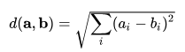

# Vector Databases

## 📚 Learning Objectives
- Understand what is an embedding
- Understand how to store embeddings in a database.
- Learn to use vector databases for storing embeddings.
- Implement a simple application that builds and stores embeddings in a database.

## 📑 Task

### Configure the Application
You need to configure the application to use a vector database for storing embeddings. You can use any vector database, such as `Postgres` with the `pgvector` plugin.
Refer to the [Qdrant store autoconfiguration](https://github.com/qdrant/java-client?tab=readme-ov-file) for guidance. or you can use any other Vector DB, but we have example for it in _**examples**_ folder

### Implement REST API Functionality
Your task is to implement a REST API with the following functionality:

1. **Build Embedding from Text**
    - Implement an endpoint to build an embedding from the provided text.
```text
POST http://localhost:9092/v1/embedding/build

HTTP/1.1 200 
[
  -60.0,
  43.0
]
```
2. **Build and Store Embedding from Text**
    - Implement an endpoint to build and store an embedding from the provided text.
````text
POST http://localhost:9092/v1/embedding/store

HTTP/1.1 200 
{
  "id": 4,
  "content": "Java is a high-level, class-based, object-oriented programming language",
  "embedding": [
    -12.0,
    71.0
  ]
}
````
3. **Search for Closest Embeddings**
    - Implement an endpoint to search for the closest embeddings in the database based on the input text.
    - Attach a screenshot showing the search for the closest embeddings in the database to your task on learn.epam.com.
```text
POST http://localhost:9092/v1/embedding/search?limit=5
Content-Type: application/json

{
  "text": "unknown"
}
###
HTTP/1.1 200 

[
  {
    "id": 1,
    "content": "Java is a high-level, class-based, object-oriented programming language",
    "distance": 105.60303025955268,
    "embedding": "[-12,71]"
  }
]


```
### Closing
Create pull requests to your repository.
Attach link to your PR to your tasks on learn.epam.com.

### Evaluation Criteria
1. Configuration for Vector Database
- Correctly configured the application to use a vector database (e.g., Qdrant with qdrant plugin or you can use any other Vector DB) (15%)

2. Build Embedding from Text
- Implemented an endpoint to build an embedding from the provided text (15%)

3. Build and Store Embedding from Text
- Implemented an endpoint to build and store an embedding from the provided text (15%)

5. Search for Closest Embeddings
- Implemented an endpoint to search for the closest embeddings in the database based on the input text (25%)

6. Functionality Testing
- Application runs without errors (15%)
- Responses are generated correctly and are relevant to the prompts (15%)

## Self-Test Questions
You can index and test your knowledge by answering the following questions:
- What is embedding?
```text
An intuitive introduction to text embeddings.

Text embeddings are key to LLMs and convert text into vector coordinates.
Embeddings are numerical representations of objects that capture their semantic meaning 
and relationships in a high-dimensional space that includes semantic relationships, contextual usage, or features. This numerical representation 
is composed by an array of numbers in which each element corresponds to a specific dimension.
``` 
- How does input with embedding differ from input in a text format?
```text

```
- Can a picture be converted to an embedding?
```text
Yes.
```
- What is Diversity measurement? What is Distance? What is Similarity in vectors?
```text
A key feature of an embedding space is that it preserves distance. The high-dimensional vectors used in text embeddings and LLMs aren’t immediately intuitive. But the basic spatial intuition remains (mostly) the same as we scale things down.

The number of dimensions in embeddings are so important because each dimension corresponds to a feature that we capture from the object. It is represented as a numerical and quantitative value, and it also defines the dimensional map where each object will be located.
Dimensionality plays a crucial role in how well these embeddings can capture the relevant features of the products. More dimensions may provide more accuracy but also more resources in terms of compute, memory, latency, and cost.


Distance metrics are mathematical measures and functions used to determine the distance (similarity) between two elements in a vector space. In the context of embeddings, distance metrics evaluate how far apart two embeddings are. A similarity query search retrieves the embeddings that are similar to a given input based on a distance metric; this input can be a vector embedding, text, or another object. There are several distance metrics. The most popular ones are the following.
Cosine Similarity.
Euclidean Distance.
Manhattan Distance.

```
 
- What is more important for text embedding: keeping a short distance for similar meaning, or keeping a short distance for semantically similar words?
```text
Cosine similarity measures the cosine of the angle between two vector embeddings, and it's often used as a distance metric in text analysis and other domains where the magnitude of the vector is less important than the direction.

Euclidean distance measures the straight-line distance between two points in Euclidean space.

Manhattan distance (L1 norm) sums the absolute differences of their coordinates.

The choice of distance metric and similarity measure has a profound impact on the behavior and performance of ML models; however, the recommendation is to use the same distance metric as the metric used to train the given model.

``` 
- What is Clustering? What is Classification?
```text

``` 
- What are vector DBs used for in GenAI?
```text

``` 

- What is the dimensionality of the vector? What is the dimensionality of the model? What is the dimensionality of the vector DB?
- Can a vector built with one model be used with another model?

- Scalability
```text
Vector databases are usually highly scalable solutions that support vertical and horizontal scaling. Horizontal scaling is based on two fundamental strategies: sharding and replication. Both strategies are crucial for managing large-scale and distributed databases.

``` 
## Docker
```shell
cd /mnt/c/Users/Marina_Pimenova/sb-projects/kernel-semantic-rag/gen_ai_training/docker-config
``` 
```shell
docker-compose --env-file ./config/.env.dev up --build
```